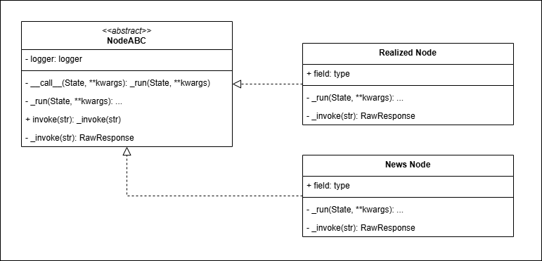
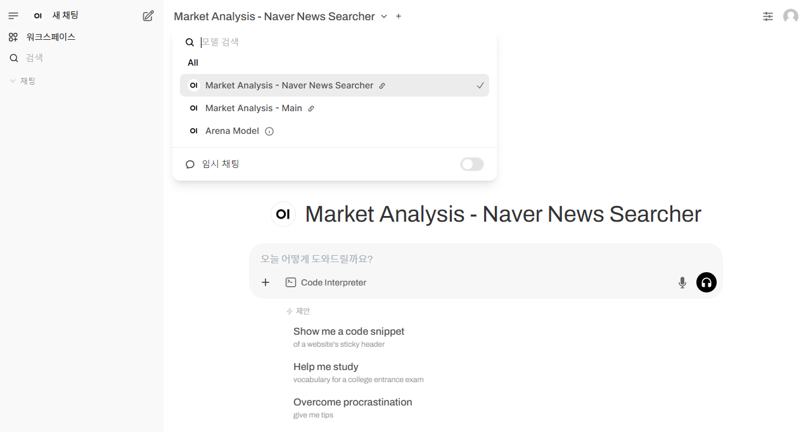

# Market Analysis Agent

## 프로젝트 개요
금융 시장 분석을 위한 AI 에이전트 시스템으로, LangGraph를 활용한 멀티 에이전트 아키텍처를 구현합니다.

## 프로젝트 구조
<!-- [아키텍처 다이어그램](./images/backend/architecture.md) -->
```bash
+------------------+     +------------------+     +------------------+
|                  |     |                  |     |                  |
|  Client Request  +---->+  FastAPI Server  +---->+  SupervisorNode  |
|                  |     |                  |     |                  |
+------------------+     +------------------+     +--------+---------+
                                                           |
                                                           |
                                                           v
                         +---------------------------+-----+-----+---------------------------+
                         |                           |           |                           |
                         v                           v           v                           v
              +----------+-----------+    +----------+----+    +-+------------+    +---------+-----------+
              |                      |    |               |    |              |    |                     |
              | NaverNewsSearcherNode|    | Future Node 1 |    | Future Node 2|    | ReportAssistantNode |
              |                      |    |               |    |              |    |                     |
              +----------------------+    +---------------+    +--------------+    +---------------------+

                                    LangGraph Multi-Agent Architecture 
```

## 시작하기
의존성 관리를 위해 가능하면 `uv`를 사용하기를 권장합니다.
 
**using uv(recommended)**
- how to install `uv`
```bash
pip install uv 
# or
curl -LsSf https://astral.sh/uv/install.sh | sh
```
- run market-analysis
```bash
git clone https://github.com/FinAgent-Lab/market-analysis-team

cd market-analysis-team

uv sync

uv run main.py
```

**using pip** 
```bash
git clone https://github.com/FinAgent-Lab/market-analysis-team

cd market-analysis-team

python -m venv .venv

source .venv/bin/activate

pip install -r requirements.txt

python main.py
```
### 코드 스타일 체크
코드를 일관성 있게 유지하기 위해 `ruff` 도구를 사용합니다. 이 도구는 많은 오픈소스 프로젝트에서 표준에 가깝게 사용되고 있습니다.
이 도구를 사용하기 위해서는 pip를 이용해서 설치해도 되고 uv 도구를 사용해도 됩니다. 

여기서는 uv 도구인 `uvx`를 사용하는 방법을 설명합니다. 

```bash
$ uvx ruff check --fix
$ uvx ruff format
```

## 에이전트 추가 및 사용자 인터페이스 연동

에이전트 개발하며 에이전트의 동작성을 수월하게 확인하고자 하였습니다. 
이를 위해 본 프로젝트는 UI 또는 API를 활용합니다.

### 에이전트 노드를 추가하는 법
구현체는 추상 클래스 Node를 실체화하여 작성합니다. 
추상 클래스 Node의 주요 함수는 `__call__`, `_run`, `_invoke`, `invoke`이며, 개발 시에는 `_run` 함수와 `_invoke` 함수(선택사항)를  작성합니다. 
`_run` 함수는 `SupervisorNode`와 연결을 위한 함수입니다.
`_invoke` 함수는 API 서버를 통해 별도의 인터페이스를 갖고 싶다면 구현합니다. 
클래스 관계도는 다음과 같습니다.


1. `src/graph/nodes/`경로에 에이전트 코드를 작성합니다.
2. 코드는 다음과 같이 작성합니다. 
```python
class NaverNewsSearcherNode(Node):
    def __init__(self):
        super().__init__()
        # 에이전트에게 역할을 부여하기 위한 프롬프트입니다.
        # 경우에 따라서는 필요없을 수 있습니다.
        self.system_prompt = (
            "You are a news search agent for korean news using naver search api."
            "Only use korean source and data to conduct news search."
            "Do nothing else"
        )
        self.agent = None
        self.tools = [NaverNewsSearch(sort="date")]


    # Supervisor 노드에서 호출했을 시의 로직을 구현하는 함수. 실제로는 base node의 run함수에서 이 함수를 호출합니다.
    def _run(self, state: dict) -> dict:

        # region [에이전트 동작 로직 구현]
        # -----------------------------------------------------------------------
        if self.agent is None:
            assert state["llm"] is not None, "The State model should include llm"
            llm = state["llm"]
            self.agent = create_react_agent(
                llm,
                self.tools,
                prompt=self.system_prompt,
            )
        result = self.agent.invoke(state)
        # ----------------------------------------------------------------------
        # endregion [에이전트 동작 로직 구현 끝]
        self.logger.info(f"   result: \n{result['messages'][-1].content}")
        # 이 부분은 동일할 것으로 예상합니다. 
        return Command(
            update={
                "messages": [
                    HumanMessage(
                        content=result["messages"][-1].content,
                        name="naver_news_searcher",
                    )
                ]
            },
            goto="supervisor",
        )

    # _run 함수와 유사하나, api를 통해 동작을 확인하기 위한 함수. supervisor와는 상관 없습니다. 
    # 이 부분은 base node의 invoke함수에서 호출합니다.
    # api 서버에 노출하기 위해 별도의 함수로 분리하였으며, 엔드포인트 경로는 소문자 및 Node를 제거한 형태입니다.
    # - 예시 : SampleNode 클래스로 코드를 작성 시, 엔드포인트는 /api/sample 입니다. 
    # OpenWebUI에 연동하기 원한다면 RawResponse 모델로 리턴할 수 있도록 작성합니다. 
    def _invoke(self, query: str) -> RawResponse:
        agent = self.agent or create_react_agent(
            ChatOpenAI(model=self.DEFAULT_LLM_MODEL),
            self.tools,
            prompt=self.system_prompt,
        )
        result = agent.invoke({"messages": [("human", query)]})
        return RawResponse(answer=result["messages"][-1].content)

```
`main.py` 파일에서 빌더를 이용하여 다음과 같이 노드를 추가할 수 있습니다:
```python
graph_builder.add_node(NaverNewsSearcherNode())
```

### 에이전트 추가 후 API 연동
API 서버의 기본 포트는 `8000`번이며, 서버 호스트의 `/docs`경로를 통해 명세를 확인할 수 있습니다.
- 예: `http://localhost:8000/docs`


### OpenWebUI에 추가하는 법

OpenWebUI에 추가하기 위해서는 pipeline 코드 작성이 필요합니다. 
예시 코드는 `pipelines/agent_pipeline_example.py`를 참고합니다. 
pipeline 코드를 작성한 후, 메인 브랜치에 병합하면 배포 과정에 동적으로 통합이 이루어집니다. 

```python
...
class Pipeline:
    class Valves(BaseModel):
        pass

    def __init__(self):
        # self.name 에 모델 이름 설정
        self.name = "Market Analysis - Naver News Searcher"
        # self.agent_name은 api 서버의 해당 에이전트 엔드포인트 이름으로 작성
        self.agent_name = "navernewssearcher"
        ...
```

OpenWebUI에 접속해보면 다음과 같이 추가되어있음을 확인할 수 있습니다.



## 파일구조
```bash
/
├── .env                        # 개인별 API Key등 환경변수 설정
├── .env.tamplate               # 환경변수 템플릿
├── requirements.txt            # 필수 라이브러리
├── pyproject.toml              # 프로젝트 설정
├── main.py                     # 전체 워크플로우 정의 및 서비스 시작점
├── startup.py                  # 의존성 주입 컨테이너 설정
├── api/                        # API 서버 관련 모듈
│   └── server.py               # FastAPI 서버 구현
├── src/                        # 소스 코드
│   ├── graph/                  # LangGraph 관련 모듈
│   │   ├── builder.py          # 그래프 빌더 클래스
│   │   └── nodes/              # 그래프 노드 모듈
│   │       ├── base.py         # 기본 노드 클래스
│   │       ├── supervisor.py   # 슈퍼바이저 노드
│   │       ├── naver_news_searcher.py # 네이버 뉴스 검색 노드
│   │       ├── ...             # 기타 추가 노드
│   │       └── report_assistant.py    # 보고서 작성 노드
│   ├── models/                 # 데이터 모델
│   │   └── graph_state.py      # 그래프 상태 모델
│   ├── tools/                  # 도구 모듈
│   └── utils/                  # 유틸리티 함수
│       └── logger.py           # 로깅 설정
├── images/                     # 도커 이미지 관련 파일
│   └── backend/                
│       └── Dockerfile          # 백엔드 도커 파일
└── tests/                      # 테스트 코드
```

## License
This project is licensed under the [MIT License](https://opensource.org/licenses/MIT).